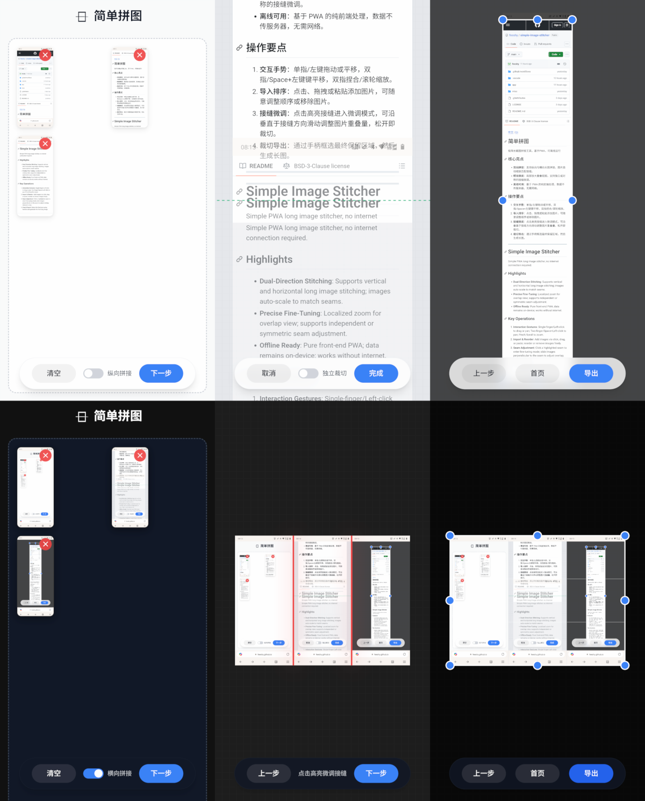

**中文** | [En](#en)

# [简单拼图](https://stitcher.feeshy.top)

极简长截图拼接工具，基于PWA，可离线运行

## 核心亮点

- **双向拼接**：支持纵向与横向长图拼接，图片自动缩放匹配接缝。
- **精准微调**：局部放大重叠视图，支持独立或对称的接缝微调。
- **离线可用**：基于 PWA 的纯前端处理，数据不传服务器，无需网络。

## 操作要点

- **交互手势**：单指/左键拖动或平移，双指/Space+左键平移，双指捏合/滚轮缩放。

1. **导入排序**：点击、拖拽或粘贴添加图片，可随意调整顺序或移除图片，然后选择纵向或横向拼接。
2. **接缝微调**：点击高亮接缝进入微调模式，可沿垂直于接缝方向滑动调整图片重叠量，松开即裁切。
3. **裁切导出**：通过手柄框选最终保留区域，然后生成长图。

---

[中文](#zh) | **En**

# [Simple Image Stitcher](https://stitcher.feeshy.top)

Simple PWA long image stitcher, no internet connection required.

## Highlights

- **Dual-Direction Stitching**: Supports vertical and horizontal long image stitching; images auto-scale to match seams.
- **Precise Fine-Tuning**: Localized zoom for overlap view; supports independent or symmetric seam adjustment.
- **Offline Ready**: Pure front-end PWA; data remains on-device; works without internet.

## Key Operations

1. **Interaction Gestures**: Single-finger/Left-click to drag or pan; Two-finger/Space+Left-click to pan; Pinch/Scroll to zoom.
2. **Import & Reorder**: Add images via click, drag, or paste; reorder or remove images freely. Then choose to stitch vertically horizontally.
3. **Seam Adjustment**: Click a highlighted seam to enter fine-tuning mode; slide images perpendicular to the seam to adjust overlap; release to crop.
4. **Crop & Export**: Select the final area using handles and generate the final long image.
